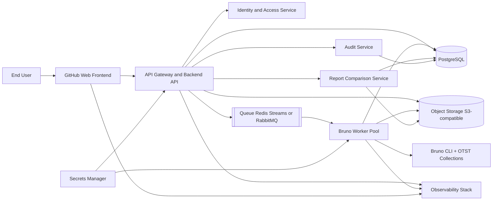

# OSCAR - OSDM Conformance Automation Runner Solution Architecture

## License and Copyright
This document is the property of UIC (Union Internationale des Chemins de fer).

"This material is copyrighted by UIC, Union Internationale des Chemins de fer © 2026. OSDM is a trademark belonging to UIC, and any use of this trademark is strictly prohibited unless otherwise agreed by UIC."

For further inquiries, please contact UIC.

## 1. Document Purpose
This document explains how to build OSCAR in practical detail, based on the high-level specification, with:
- A GitHub-centered web delivery model.
- A cloud backend for scenario execution.
- A strict cloud-provider-agnostic architecture.

The target outcome is a production-ready platform where users can register, submit OTST/Bruno runs, and review and compare reports.

## 2. Architecture Principles
The solution must follow these principles:

1. Cloud agnostic by design
- Avoid provider-specific APIs in core application code.
- Use open standards and portable components (containers, Kubernetes, PostgreSQL, Redis, S3-compatible storage API).
- Isolate cloud-specific logic behind adapters and infrastructure modules.

2. Security first
- Encrypt secrets at rest and in transit.
- Enforce tenant isolation and role-based access control.
- Keep API tokens out of logs and UI traces.

3. Asynchronous and scalable execution
- Decouple user requests from test execution via queue-driven workers.
- Scale workers horizontally based on queue depth.

4. Full traceability
- Every run must be auditable with who/when/what/where metadata.
- Reports and run logs must be versioned and immutable.

## 3. Logical Solution View
OSCAR is built from six main domains:

1. GitHub Web Frontend
- Single-page web application (React or Next.js static export).
- Source code and pull request workflow hosted on GitHub.
- CI/CD via GitHub Actions.
- Deploy to a portable web hosting target (containerized web server or static site bucket + CDN).

2. API Gateway and Backend Service
- REST API for auth, run submission, run status, artifacts, and report comparison.
- Stateless backend service (Node.js, .NET, or Java) in containers.
- OAuth2/JWT authentication and role enforcement.

3. Orchestration and Queue
- Backend writes run requests to queue.
- Worker fleet consumes queued jobs.
- Retry, dead-letter queue, and timeout controls.

4. Bruno Execution Workers
- Containerized worker image with Bruno CLI and OTST collections.
- One isolated execution context per run.
- Generates logs, structured results, and reports.

5. Persistent Data Services
- PostgreSQL for relational data.
- Object storage for data files, run artifacts, and report outputs.
- Redis (or equivalent) for queue and short-term cache.

6. Observability and Security Services
- Centralized logs, metrics, traces.
- Secrets vault abstraction.
- Audit events stream.

### 3.1 Solution Architecture Design Schema
The following schema shows the end-to-end flow from user request to Bruno execution and report comparison.



Execution sequence summary:
1. User submits run parameters from the web frontend.
2. API validates tenant context and stores run metadata.
3. API places run job into queue.
4. Worker consumes job and executes Bruno scenario.
5. Worker stores logs and reports, then updates run status.
6. Frontend reads status and renders artifacts and report comparisons.

## 4. Cloud-Agnostic Reference Stack
To stay provider neutral, use the following stack:

- Runtime: Docker + Kubernetes.
- Packaging: Helm charts.
- Infrastructure as code: Terraform or OpenTofu with provider-specific modules.
- Database: PostgreSQL (managed or self-hosted).
- Queue: Redis streams or RabbitMQ.
- Object storage: S3-compatible API layer.
- Ingress: NGINX Ingress Controller.
- Secret management: External Secrets Operator with pluggable secret backends.
- CI/CD: GitHub Actions.

Important rule:
Application services must only call generic interfaces (SQL, Redis protocol, S3 API, HTTP). No direct coupling to cloud-native SDKs in business logic.

### 4.1 Open-Source Solution Options by Element
The table below proposes open-source options for each element of OSCAR.

| Solution Element | Primary Open-Source Option | Alternative Open-Source Option(s) | Usage in OSCAR |
|---|---|---|---|
| Web page creation (frontend) | React + Vite | Next.js, Vue.js + Nuxt | Build sign-up, run request, results, and comparison pages |
| UI component framework | MUI | Ant Design, Mantine | Accelerate consistent enterprise UI and forms |
| Frontend auth integration | Auth.js | Ory SDK, Keycloak JS adapters | Handle login sessions and token refresh |
| API backend framework | NestJS (Node.js) | FastAPI (Python), Spring Boot (Java) | Implement REST API, validation, and business rules |
| API gateway | Kong Gateway | Traefik, Apache APISIX | Route traffic, apply auth, throttling, and policies |
| User credential and login management | Keycloak | Ory Kratos + Ory Hydra, Zitadel | User registration, password policies, OIDC/OAuth2, RBAC |
| Password hashing library | Argon2 | bcrypt | Secure local credential storage if managed in-house |
| Queue and async messaging | RabbitMQ | Redis Streams, NATS JetStream | Decouple run request from Bruno execution |
| Worker runtime | Kubernetes Jobs | Argo Workflows, Nomad | Isolated and scalable execution of scenario jobs |
| Scenario execution engine | Bruno CLI | Newman (Postman), Karate | Execute OTST API scenarios in CI and worker containers |
| Relational database | PostgreSQL | MariaDB | Persist users, companies, runs, events, and reports |
| Database migrations | Flyway | Liquibase, Prisma Migrate | Version and deploy schema changes safely |
| Object storage interface | MinIO (S3 API) | Ceph RGW, SeaweedFS | Store data files, logs, reports, and artifacts |
| File malware scanning (optional) | ClamAV | YARA-based scanner pipelines | Scan uploaded files before worker consumption |
| Secrets management | HashiCorp Vault | Bitnami Sealed Secrets, SOPS + KMS plugin | Manage API tokens and encryption keys |
| Kubernetes secret sync | External Secrets Operator | Secrets Store CSI Driver | Inject secrets into API and worker pods |
| Observability metrics | Prometheus + Grafana | VictoriaMetrics + Grafana | Track API latency, queue depth, run success rate |
| Centralized logs | OpenSearch + OpenSearch Dashboards | Loki + Grafana, ELK | Search execution logs and troubleshoot failures |
| Distributed tracing | OpenTelemetry + Jaeger | OpenTelemetry + Tempo | Trace requests across frontend, API, and workers |
| Audit event processing | Apache Kafka | Redpanda, NATS | Capture immutable audit streams for compliance |
| CI/CD platform | GitHub Actions | Jenkins, Woodpecker CI | Build, test, scan, and deploy from GitHub |
| GitOps deployment | Argo CD | Flux CD | Declarative deployment to any Kubernetes cluster |
| Infrastructure as code | OpenTofu | Terraform | Provision cloud resources in a portable way |
| Policy as code | Open Policy Agent (OPA) | Kyverno | Enforce tenant/security policies at runtime |
| TLS and certificate automation | cert-manager | Traefik ACME integration | Automate certificate lifecycle |

Selection guidance:
- For fastest enterprise-ready identity, start with Keycloak.
- For minimal operational burden, prefer PostgreSQL + RabbitMQ + MinIO interfaces backed by managed cloud equivalents.
- For cloud neutrality, keep application code dependent only on OIDC, SQL, AMQP or Redis protocol, and S3 APIs.

## 5. Detailed Build Architecture

### 5.1 Repository Strategy on GitHub
Use a mono-repo with clear boundaries:

- apps/web: frontend UI.
- apps/api: backend API service.
- apps/worker: Bruno execution service.
- packages/shared: common DTOs, validation schemas, auth helpers.
- infra/terraform: environment provisioning.
- infra/helm: Kubernetes deployment charts.
- docs: architecture and runbooks.

Branching and quality gates:
- Main branch protected.
- Pull request reviews mandatory.
- Required checks: unit tests, lint, SAST, container image scan.

### 5.2 Frontend (GitHub Web)
Core pages:
- Sign up and sign in.
- Scenario Run Request.
- Runs list and run detail.
- Report comparison.

Frontend technical design:
- Form validation on endpoint format, token length, requestor, and data file schema checks.
- Upload data file with pre-signed URL pattern.
- Polling or server-sent events for run status updates.
- Role-aware UI: user, company admin, system admin.

Security controls:
- Store auth token in secure HTTP-only cookie.
- Never persist OSDM API token in browser storage.

### 5.3 Backend API
Recommended bounded contexts:
- Identity and Access.
- Run Management.
- Artifact Management.
- Report Comparison.

Representative endpoints:
- POST /v1/auth/register
- POST /v1/auth/login
- POST /v1/runs
- GET /v1/runs
- GET /v1/runs/{runId}
- GET /v1/runs/{runId}/logs
- GET /v1/runs/{runId}/artifacts
- POST /v1/reports/compare

Backend responsibilities:
- Validate run request payload.
- Resolve tenant context from authenticated user.
- Persist run as Queued.
- Push job to queue with correlation ID.
- Return run ID immediately.

### 5.4 Worker and Bruno Runtime
Worker flow for each run:
1. Pull job from queue.
2. Fetch data file from object storage.
3. Build runtime environment variables (endpoint, token, requestor).
4. Execute Bruno CLI against OTST collection.
5. Stream execution logs.
6. Parse output into normalized result model.
7. Upload artifacts to object storage.
8. Update run status in database.

Isolation strategy:
- Per-run ephemeral directory.
- CPU and memory quotas per worker container.
- Hard timeout per run and graceful cancellation.

### 5.5 Report Diff Engine
Report comparison model:
- Input: report A and report B.
- Compare scenario IDs and assertion outcomes.
- Derive categories:
  - Failed to Passed.
  - Passed to Failed.
  - Added scenarios.
  - Removed scenarios.
  - Unchanged.

Store comparison snapshots so users can revisit the same diff without recomputation.

## 6. Data Model (High Level)
Core tables:
- companies
- users
- roles
- runs
- run_events
- run_artifacts
- reports
- report_comparisons
- audit_log

Key relationships:
- One company has many users.
- One run belongs to one company and one user.
- One run can produce many artifacts.
- Report comparison references two reports from the same company scope.

## 7. Security Architecture

1. Identity
- Local account system or federated identity via OIDC.
- JWT access tokens with short expiry and refresh flow.

2. Tenant isolation
- Every query filtered by company_id.
- API middleware enforces tenant scope.

3. Secret handling
- OSDM token encrypted before persistence.
- Decrypt only in worker at execution time.
- Token masking in logs.

4. Transport and data protection
- TLS 1.2+ end to end.
- Encryption at rest for database volumes and object storage.

5. Audit
- Track account creation, login, run submission, run cancellation, report access, report comparison.

## 8. CI/CD with GitHub Actions
Pipeline stages:

1. Pull request pipeline
- Lint and unit tests.
- Build frontend, API, worker.
- Security scans (dependency, code, container).

2. Main branch pipeline
- Build signed container images.
- Push to OCI registry.
- Publish Helm chart.
- Deploy to target environment through GitOps or controlled deploy job.

3. Environment promotion
- Dev -> Test -> Prod with approval gates.
- Same artifacts across environments.

Cloud-agnostic recommendation:
Use GitHub Actions reusable workflows and environment variables for provider-specific details (cluster endpoint, registry URL, secret backend id) without changing application code.

## 9. Deployment Topology
Minimum production topology:
- 2+ web replicas.
- 2+ API replicas.
- Worker autoscaling group.
- Highly available PostgreSQL.
- Highly available Redis or queue cluster.
- Object storage bucket with lifecycle policy.
- Ingress with WAF and rate limiting.

For strict portability:
- Keep Kubernetes manifests and Helm values provider-neutral.
- Separate cloud-specific networking and IAM in Terraform modules.

## 10. Operations and SRE
Operational baselines:
- SLO for run submission API and run completion latency.
- Alerts for queue backlog, worker failure rate, and failed run spikes.
- Daily backup for PostgreSQL and artifact retention policy.
- Disaster recovery drills with defined RTO/RPO.

Support runbooks:
- Stuck run handling.
- Queue dead-letter replay.
- Report diff troubleshooting.
- Secret rotation process.

### 10.1 Production Observability and Self-Healing Stack (since v1.7 / v1.8)

The reference deployment ships an opt-in observability + watchdog overlay
co-located on the same host as OSCAR. All components are open-source, all
share the same SSO provided by OSCAR (no separate logins).

| Concern | Component | Role |
|---|---|---|
| Metrics scraping | **Prometheus** | Pulls `oscar_*` metrics every 15 s (15-day TSDB retention). |
| Log aggregation | **Loki + Promtail** | Promtail tails container stdout/stderr via the Docker socket; Loki indexes by container/stream labels. |
| Visualisation | **Grafana** | Pre-provisioned **OSCAR · Overview** + **OSCAR · Logs** dashboards. SSO via `auth.proxy` + nginx `auth_request`. |
| Container health probe | **Docker `healthcheck`** | Hits `/health` every 30 s, requires DB + queue + data dir all OK. |
| Auto-restart | **Autoheal sidecar** | Restarts any `autoheal=true`-labelled container that Docker reports `unhealthy` (transient hangs heal without paging a human). |
| Alert routing & email | **Alertmanager** | Receives Prometheus alerts, dedupes, groups, emails OSCAR admins via the production SMTP relay. Re-pages criticals every 1 h, warnings every 4 h. |

**Default alert ruleset:** server unreachable, restart loop, queue stuck,
sustained run failure rate, SMTP degradation, login attack burst, memory
leak, event-loop lag. Each alert carries a `runbook` annotation pointing
to the relevant section of the admin guide. Operators silence alerts
during planned maintenance via `amtool` or the Grafana silences UI.

The full overlay adds **~415 MB RAM** and **~600 MB disk after 30 days**
on top of the base OSCAR footprint — sized for a small VPS.

Detailed setup, troubleshooting, and rule definitions:
- [`Documentation/Server_Operations/metrics-and-monitoring.md`](../Server_Operations/metrics-and-monitoring.md)
- [`Documentation/Server_Operations/OSCAR - Server Admin Guide.md` § 13–14](../Server_Operations/OSCAR%20-%20Server%20Admin%20Guide.md)

## 11. Delivery Roadmap

Phase 1 (MVP) — see Section 14 for detailed MVP architecture
- Account management.
- Run submission and execution.
- Basic results page.
- Artifact download.
- Report comparison (basic diff).

Phase 2
- Multi-user per company and role model.
- Report comparison page and diff categories.
- Improved observability and audit dashboards.

Phase 3
- Scheduled runs.
- Notifications.
- Trend analytics and compliance scorecards.

## 12. Acceptance Criteria
The solution is considered compliant with this architecture when:
- A user can register, submit a run, and retrieve artifacts end to end.
- Worker execution is asynchronous and isolated.
- Report comparison is available for two selected reports.
- All components deploy on at least two different cloud providers with no code changes in application services.
- Security controls and audit logging are active in production.

## 13. Summary
This solution architecture provides a practical, secure, and scalable way to run OSCAR with a GitHub-based web delivery model and a cloud backend while preserving cloud-provider neutrality through open standards, containerized services, and strict separation of cloud-specific infrastructure concerns from business logic.

---

## 14. MVP Implementation Proposal
*Added 2026-04-04 — Pragmatic first delivery targeting a working local server before cloud migration.*

### 14.1 Rationale
The full target architecture (Section 3–10) is the correct long-term goal. However, building Kubernetes, Keycloak, Kafka, Vault, and Terraform from scratch is a multi-month infrastructure effort. The MVP delivers the same logical architecture — identical API contracts, data model, run lifecycle, and report diff logic — using a lightweight local stack that is **designed to be migrated component by component** to the full cloud stack without rewriting business logic.

### 14.2 MVP Stack Mapping

| Spec Component | Full Vision (Sections 3–10) | MVP Equivalent |
|---|---|---|
| Frontend | React + Vite, MUI | Plain HTML / CSS / vanilla JS (zero build step) |
| API Backend | NestJS or FastAPI | **Node.js + Express** |
| Authentication | Keycloak / OIDC / JWT | **JWT + bcrypt** (local user table) |
| Queue | RabbitMQ / Redis Streams | **In-process async job queue** (Bull-compatible interface) |
| Database | PostgreSQL + Flyway | **SQLite** (embedded, zero-install, same SQL schema) |
| Object Storage | MinIO / S3 API | **Local filesystem** (same path conventions, S3 interface added in Phase 2) |
| Worker Runtime | Kubernetes Jobs / containers | **Node.js child_process** spawning Bruno CLI directly |
| Secrets Vault | HashiCorp Vault / ESO | **Environment variables + encrypted SQLite column** |
| Observability | Prometheus / OpenSearch | **Structured JSON logs to file** |
| CI/CD | GitHub Actions | **Manual for MVP; GitHub Actions wired in Phase 2** |

**Key design constraint:** All business logic (run lifecycle, report diff, artifact management, auth middleware) is written against generic interfaces (SQL, filesystem, HTTP) so each infrastructure layer can be swapped without touching application code.

### 14.3 Dynamic Environment Generation (Design Decision — 2026-04-04)

OSCAR does **not** use pre-configured Bruno environment files. Instead, it generates a dedicated
ephemeral `.yml` environment file per run from the company profile and run inputs.

#### 14.3.1 Run Input Form Fields

| UI Field | Bruno Env Variable | Required | Notes |
|---|---|---|---|
| API Endpoint | `api_base` | Yes | e.g. `https://api.company.com/osdm/v3` |
| Bearer Token | `access_token` | Conditional | Used in Bearer Token mode |
| Token URL | `token_url` | Conditional | Used in OAuth2 mode |
| Client ID | `client_id` | Conditional | Used in OAuth2 mode |
| Client Secret | `client_secret` | Conditional | Used in OAuth2 mode |
| Requestor | `requestor` | Optional | Required by some operators (e.g. Turnit, Benerail) |
| Data file upload | `data_base` | First run only | Stored as `{companyName}-datafile.json` |
| *(injected by server)* | `library_base` | — | Absolute path to `library-bruno/` |
| *(injected by server)* | `json_schema` | — | Fixed GitHub raw URL |
| *(injected by server)* | `scenariosToRunIndex` | — | Always `"0"` |

#### 14.3.2 Dual Authentication Mode (Design Decision — 2026-04-04)

Companies choose **once** in their profile which auth mode applies to their API:

**Mode A — Bearer Token**
- User provides a pre-obtained bearer token.
- OSCAR sets it directly as `access_token` in the generated environment.
- No OAuth request is made.

**Mode B — OAuth2 Client Credentials**
- User provides `client_id`, `client_secret`, and `token_url`.
- OSCAR performs the token exchange **before** spawning Bruno, using a standard
  `POST {token_url}` with `grant_type=client_credentials`.
- The obtained `access_token` is injected into the generated environment.
- Token is never logged.

In both modes, the `00-Access Token` folder requests inside the Bruno collection are
**automatically skipped** by the smart run filter in `opencollection.yml` (the filter checks
that the token request name contains the sandbox name; since no existing token request
matches the company's dynamic env name, all are skipped). The pre-resolved `access_token`
is used directly.

#### 14.3.3 Persistent Data File (Design Decision — 2026-04-04)

- The data file is stored **per company**, not per run: `data/{companyName}-datafile.json`.
- It is served by the OSCAR API at `http://localhost:{port}/data/{companyName}-datafile.json`
  so Bruno can fetch it as `data_base` during execution.
- The user uploads a new version at any time from the company profile page.
- Each run records which data file version (by hash and upload timestamp) was active at
  execution time, ensuring full traceability.
- On first run submission, a data file must be present; the UI blocks submission otherwise.

#### 14.3.4 Generated Environment File (example)

```yaml
name: OTST_AcmeCorp_Env
variables:
  - name: access_token
    value: "eyJhbGciOiJSUzI1NiJ9..."
  - name: api_base
    value: "https://api.acmecorp.com/osdm/v3"
  - name: requestor
    value: "acmecorp-requestor-id"
  - name: library_base
    value: "./library-bruno/"
  - name: data_base
    value: "http://localhost:3001/data/acmecorp-datafile.json"
  - name: json_schema
    value: "https://raw.githubusercontent.com/UnionInternationalCheminsdeFer/OSDM-testing/refs/heads/exch_dev/json_validator/datafile.schema.json"
  - name: scenariosToRunIndex
    value: "0"
```

> **Critical implementation note:** No variable uses `secret: true`. The Bruno CLI does not
> read the `value` field from secret-flagged entries in `.yml` files — it expects secret
> values to come from a separate encrypted store. Using `secret: true` results in an empty
> `access_token` and every OSDM API call returning HTTP 401. Since this file is ephemeral
> (deleted immediately after the run), writing credentials as plain variables is safe.

This file is written to `{COLLECTION_PATH}/environments/` at run start and deleted immediately
after `bru.cmd` exits. The token is never stored in the application database in plain text —
only the AES-256-GCM encrypted form is persisted.

### 14.4 MVP Folder Structure

```
oscar-server/
├── src/
│   ├── api/
│   │   ├── routes/
│   │   │   ├── auth.js          # POST /v1/auth/register, /login, GET /me
│   │   │   ├── runs.js          # POST/GET /v1/runs, /runs/:id, /logs, /artifacts, /cancel
│   │   │   ├── company.js       # GET/PATCH company profile, POST datafile upload
│   │   │   └── reports.js       # POST /v1/reports/compare
│   │   └── middleware/
│   │       ├── auth.js          # JWT validation (requireAuth)
│   │       └── tenant.js        # Company scope enforcement (enforceTenant)
│   ├── db/
│   │   ├── schema.sql           # SQLite schema (mirrors Section 6 data model)
│   │   └── db.js                # DatabaseSync connection, AES-256-GCM encrypt/decrypt helpers
│   ├── worker/
│   │   ├── queue.js             # EventEmitter-based in-process FIFO job queue
│   │   └── runner.js            # child_process → bru.cmd → log capture → artifact linking
│   ├── reports/
│   │   └── diff.js              # Report diff engine (Section 5.5 logic)
│   └── server.js                # Express app entry point
├── public/
│   ├── index.html               # Login / Register
│   ├── profile.html             # Company profile: endpoint, auth mode, credentials, data file
│   ├── dashboard.html           # Runs list with multi-select comparison
│   ├── run.html                 # Run submission form
│   ├── run-detail.html          # Live log polling, assertions summary, artifact open/download
│   └── compare.html             # Report comparison diff view (6 categories)
├── data/
│   ├── oscar.db                 # SQLite database file (single file = full state)
│   ├── datafiles/               # Uploaded data files ({slug}-datafile.json per company)
│   └── artifacts/               # Per-run artifacts: {runId}/report.html, {runId}/.bru_results.json
├── package.json                 # Dependencies: express, bcrypt, jsonwebtoken, multer, uuid, cors, dotenv
└── .env                         # PORT, JWT_SECRET, ENCRYPTION_KEY, COLLECTION_PATH, BRU_CMD, ...
```

### 14.4 MVP API Endpoints
All endpoints match the spec (Section 5.3) exactly, ensuring full compatibility with the future cloud backend.

| Method | Path | Description |
|---|---|---|
| POST | /v1/auth/register | Create user account (username, password, company) |
| POST | /v1/auth/login | Authenticate, return JWT |
| POST | /v1/runs | Submit a run (env, endpoint, token, requestor) |
| GET | /v1/runs | List runs for authenticated company |
| GET | /v1/runs/:id | Run metadata and current status |
| GET | /v1/runs/:id/logs | Execution log lines |
| GET | /v1/runs/:id/artifacts | Links to downloadable HTML report |
| POST | /v1/reports/compare | Diff two run reports, return structured comparison |

### 14.5 Run Lifecycle (MVP — as implemented)

```
User submits run
      ↓
API validates JWT + payload (endpoint set? credentials set? data file uploaded?)
      ↓
DB: INSERT run (status = QUEUED) — snapshots api_base, auth_mode, datafile_hash
      ↓
In-process FIFO queue: enqueue job (MAX_CONCURRENT_RUNS enforced)
      ↓
Runner: resolve access token
  ├─ bearer mode  → decrypt stored token from DB
  └─ oauth2 mode  → POST {token_url} with client_credentials grant
      ↓
Runner: generate ephemeral {COLLECTION_PATH}/environments/OTST_{slug}_Env.yml
  (plain variables only — no secret: true — see Section 14.3.4)
      ↓
Runner: spawn bru.cmd run --sandbox=developer --env {envName}
                          --reporter-json Validation_Reports/.bru_results.json
  cwd = COLLECTION_PATH, shell = true
  (relative path for --reporter-json avoids space-in-path splitting issue)
      ↓
Runner: stream stdout/stderr line-by-line → DB run_events (real-time)
      ↓
Runner: delete ephemeral env file immediately after bru.cmd exits
      ↓
Runner: scan Validation_Reports/ for {dateStr}_{envShort}_{SCENARIO_CODE}_Report.html
  (prefers files WITH scenario code in name; excludes mergeReport.js plain output)
  → copy to data/artifacts/{runId}/report.html
  → INSERT into run_artifacts (type = html_report)
      ↓
Runner: invoke mergeReport.js {envName} (merges .bru_results.json + .report_tmp.json)
  (fallback only: reportGenerator.js is the primary report generator; mergeReport.js
   only runs after Bruno completes and its output is used only if reportGenerator.js
   produced nothing)
      ↓
Runner: copy Validation_Reports/.bru_results.json → data/artifacts/{runId}/.bru_results.json
  → INSERT into run_artifacts (type = json_results)
      ↓
DB: UPDATE run (status = COMPLETED | FAILED, exit_code, completed_at)
      ↓
Frontend polls GET /v1/runs/:id every 1.5 s → renders live logs
      ↓
On completion: loadArtifacts() → "🔍 Open Report" links to /artifacts/{runId}/report.html
  (static file route — no auth header required for browser to open in new tab)
```

### 14.6 Report Diff Engine (MVP)
Implements the Section 5.5 comparison model:
- Input: two run IDs (must belong to same company).
- Source data: `.bru_results.json` stored per run in `data/artifacts/`.
- Output categories per scenario/assertion:
  - `FAILED_TO_PASSED` — regression fixed.
  - `PASSED_TO_FAILED` — regression introduced.
  - `ADDED` — new scenario in run B.
  - `REMOVED` — scenario present in run A, absent in run B.
  - `UNCHANGED` — same result in both runs.
- Comparison snapshot persisted to `report_comparisons` table for instant replay.

### 14.7 Data Model (SQLite — matches Section 6)

```sql
-- companies
--   id, name, slug (used for datafile filename)
--   auth_mode          TEXT  -- 'bearer' | 'oauth2'
--   api_base           TEXT  -- OSDM endpoint
--   access_token_enc   TEXT  -- AES-encrypted bearer token (bearer mode)
--   client_id_enc      TEXT  -- AES-encrypted client ID (oauth2 mode)
--   client_secret_enc  TEXT  -- AES-encrypted client secret (oauth2 mode)
--   token_url          TEXT  -- OAuth2 token endpoint (oauth2 mode)
--   requestor_enc      TEXT  -- AES-encrypted requestor header value (optional)
--   datafile_path      TEXT  -- local path to {slug}-datafile.json
--   datafile_hash      TEXT  -- SHA-256 of last uploaded file
--   datafile_updated_at TEXT

-- users
--   id, company_id, email, password_hash, role ('admin'|'member'), created_at

-- runs
--   id (UUID), company_id, user_id
--   status             TEXT  -- QUEUED | RUNNING | COMPLETED | FAILED | CANCELLED
--   auth_mode_used     TEXT  -- snapshot of mode at time of run
--   api_base_used      TEXT  -- snapshot of endpoint at time of run
--   datafile_hash_used TEXT  -- snapshot of datafile version at time of run
--   queued_at, started_at, completed_at
--   exit_code          INTEGER

-- run_events          -- log lines streamed during execution
--   id, run_id, ts, level ('stdout'|'stderr'|'info'), message

-- run_artifacts       -- links to files produced by the run
--   id, run_id, type ('html_report'|'json_results'), filename, path

-- report_comparisons  -- stored diff snapshots
--   id, company_id, run_a_id, run_b_id, diff_json, created_at
```

Full `schema.sql` is generated as part of Phase 1 build.

### 14.8 Build Phases and Checklist

#### Phase 0 — Prerequisites ✅ COMPLETED 2026-04-04
- [x] Bruno CLI confirmed: `@usebruno/cli@3.2.2` at `C:\Users\patri\AppData\Roaming\npm\bru.cmd`.
- [x] Target folder confirmed: `C:\...\UIC-OSCAR\oscar-server\`.
- [x] No pre-configured environments in UI — environment is generated dynamically per run from company profile inputs (see Section 14.3).
- [x] Runner mode: `bru.cmd` called directly via Node.js `child_process` (PowerShell `.ps1` execution policy blocks `.ps1` in spawned contexts; `bru.cmd` has no such restriction).
- [x] Auth mode: dual mode — company chooses Bearer Token or OAuth2 Client Credentials (see Section 14.3.2).
- [x] Data file: stored per company, reused across runs, user can upload new version at any time (see Section 14.3.3).

#### Phase 1 — Backend Foundation ✅ COMPLETED 2026-04-04
- [x] `package.json` — dependencies: express, bcrypt, jsonwebtoken, uuid, cors, dotenv, multer.
- [x] SQLite via built-in `node:sqlite` (`DatabaseSync`) — no native compilation required. `better-sqlite3` was attempted but rejected due to missing Visual C++ Build Tools.
- [x] `schema.sql` — tables: schema_version, companies, users, runs, run_events, run_artifacts, report_comparisons.
- [x] `db.js` — AES-256-GCM encrypt/decrypt helpers using `process.env.ENCRYPTION_KEY`; generic `get`, `all`, `run`, `transaction` helpers.
- [x] Auth routes (`/v1/auth/register`, `/v1/auth/login`, `/v1/auth/me`) + JWT middleware.
- [x] Tenant middleware — every query scoped to `company_id` derived from JWT.

#### Phase 2 — Run Management ✅ COMPLETED 2026-04-04
- [x] Company profile routes (`GET/PATCH /v1/company`, `POST /v1/company/datafile`).
- [x] Run submission, EventEmitter-based FIFO job queue, runner with `child_process.spawn`.
- [x] Live log streaming — stdout/stderr captured line-by-line → `run_events` table.
- [x] Ephemeral env file written to `environments/` and deleted after run.
- [x] Artifact linking: `reportGenerator.js` HTML report + `.bru_results.json`.
- [x] Run list and run detail endpoints with ownership validation.
- [x] Run cancellation for QUEUED runs.

#### Phase 3 — Report Comparison ✅ COMPLETED 2026-04-04
- [x] `.bru_results.json` parser in `diff.js`.
- [x] Diff engine with six outcome categories: FAILED_TO_PASSED, PASSED_TO_FAILED, ADDED, REMOVED, UNCHANGED_PASS, UNCHANGED_FAIL.
- [x] `POST /v1/reports/compare` endpoint + snapshot persistence to `report_comparisons` table.

#### Phase 4 — Web UI ✅ COMPLETED 2026-04-04
- [x] `index.html` — Login / Register.
- [x] `profile.html` — Company profile: API endpoint, auth mode selector, credentials, requestor, data file upload.
- [x] `dashboard.html` — Runs list with status badges, multi-select for comparison, compare button.
- [x] `run.html` — Run submission form with pre-flight validation.
- [x] `run-detail.html` — Live log polling (1.5 s), metadata tiles, artifact open/download.
- [x] `compare.html` — Diff view with 6-category filter bar and summary tiles.

#### Phase 5 — Integration Smoke Test ✅ COMPLETED 2026-04-04
- [x] End-to-end run against Bileto OSDM API (`https://osdm-5.platform.bileto.zone/api`).
- [x] Full OTST_RFND_PATCH_SRCH_CRIT_1ADT_1LEG scenario executed: 30 requests, 150+ assertions.
- [x] HTML report artifact served and opened in browser.
- [x] Genuine OSDM conformance failures detected (currency mismatch, missing afterSalesConditions, invalid fulfillmentStatus enum values) — demonstrating OSCAR correctly identifies non-conformances.

### 14.9 Implementation Issues Discovered and Resolved

Three critical bugs were discovered and fixed during the first real end-to-end run (2026-04-04). They are documented here because they reflect non-obvious constraints of the Bruno CLI and Windows filesystem, relevant to any future migration.

---

#### Issue 1 — `better-sqlite3` native compilation failure

**Symptom:** `npm install` failed with:
```
npm error gyp ERR! node-gyp -v v12.2.0
npm error not ok
```
**Root cause:** `better-sqlite3` requires native compilation via `node-gyp`, which requires Visual C++ Build Tools not available on the development machine.

**Fix:** Replaced `better-sqlite3` with the Node.js 22+ built-in `node:sqlite` module (`const { DatabaseSync } = require('node:sqlite')`). No native compilation, no extra package, identical SQL interface.

**Lesson for migration:** When replacing SQLite with PostgreSQL, the `pg` package is pure JavaScript and will not have this issue.

---

#### Issue 2 — `--reporter-json` absolute path broken by space in directory name

**Symptom:** Bruno was spawned with `shell: true` and an absolute path for `--reporter-json`. The path contained a space (`UIC_New_Revenue_Management project\...`). Bruno received only the fragment after the space as a relative path, causing a "path not found" error.

**Root cause:** `spawn()` with `shell: true` serialises the argument array into a shell command string. A space inside a path that is not additionally quoted by the shell splits the argument.

**Fix:** Use a relative path (`Validation_Reports/.bru_results.json`) matching the convention already used by `run_tests.ps1`. Bruno resolves it from `cwd = COLLECTION_PATH`. The absolute path is reconstructed for post-processing: `path.join(valDir, '.bru_results.json')`.

**Lesson for migration:** When running in containers (Phase 3), `cwd` will be the collection mount point inside the container and the path will contain no spaces — this issue will not recur.

---

#### Issue 3 — `secret: true` in Bruno `.yml` env file suppresses `value`

**Symptom:** After the runner started successfully and Bruno spawned, every OSDM API call returned HTTP 401. The HTML report showed `{"status":401,"title":"Unauthorized","detail":"Missing Bearer token."}` for every step.

**Root cause:** The generated env `.yml` file used `secret: true` on the `access_token` variable (and others) with the intention of protecting the value. However, the Bruno CLI does not read the `value` field from `secret: true` entries in `.yml` files — it expects secrets to be resolved from a separate encrypted `.env.local` store. As a result, `access_token` was injected as an empty string into every request.

**Fix:** Removed `secret: true` from all variables in `buildEnvYml()`. Since the env file is ephemeral (written immediately before the run and deleted immediately after), there is no security risk in writing credentials as plain variables. A code comment was added to document this constraint for future maintainers.

**Lesson for migration:** In the full architecture, the worker will inject credentials as environment variables from Vault at pod startup (not via `.yml` files), bypassing this limitation entirely.

---

#### Issue 4 — Artifact download returning 401 in browser new tab

**Symptom:** Clicking the "View / Download" button in `run-detail.html` opened a new browser tab that showed `{"status":401,"title":"Unauthorized","detail":"Missing Bearer token."}`.

**Root cause:** The artifact download endpoint (`GET /v1/runs/:id/artifacts/:aid`) required a JWT Bearer token in the `Authorization` header. A browser navigating to a URL in a new tab cannot attach custom headers — it performs a plain HTTP GET.

**Fix:** Added a public static file route in `server.js`:
```javascript
app.use('/artifacts', express.static(ARTIFACTS_DIR));
```
Artifacts are now accessible at `/artifacts/{runId}/report.html` without authentication. The run UUID (128-bit random) acts as an unguessable path segment, providing adequate security for the MVP. The authenticated API endpoint is retained for programmatic access.

The "Open Report" button in `run-detail.html` was updated to link to the static path for HTML reports.

**Lesson for migration:** In the full architecture, artifacts are stored in object storage and accessed via pre-signed URLs with a short TTL — the same principle (unguessable URL, no bearer token in browser request) applies.

---

#### Issue 5 — Wrong HTML report file selected as artifact

**Symptom:** The run completed, the artifact was linked, but opening the report showed only the OSDM Scenario Step 1 section with minimal content.

**Root cause:** Two HTML files exist in `Validation_Reports/` after a run:

| File | Written by | Content |
|---|---|---|
| `{date}_{env}_{SCENARIO_CODE}_Report.html` | `reportGenerator.js` (during Bruno run) | Full report — all requests, all assertions |
| `{date}_{env}_Report.html` | `mergeReport.js` (after Bruno run, fallback only) | Merged report from `.bru_results.json` — used only if `reportGenerator.js` produced nothing; may be incomplete if JSON format mismatches |

The artifact scan used `mtime` to select the most recent file. Because `mergeReport.js` runs *after* `bru.cmd`, its output is always the newest — and it was always selected.

**Fix:** The scan now explicitly excludes the exact `{date}_{env}_Report.html` filename (the `mergeReport.js` output pattern, which has no scenario code). Any file with a scenario code in the name — e.g. `{date}_{env}_OTST_RFND_PATCH_SRCH_CRIT_1ADT_1LEG_Report.html` — is preferred. `mergeReport.js` is still executed and its output is used as a fallback only if no `reportGenerator.js` file is found.

---

### 14.10 Migration Path to Full Architecture
Each MVP component maps directly to a Phase 2 / Phase 3 cloud replacement:

| MVP Component | Replace With | When |
|---|---|---|
| SQLite | PostgreSQL + Flyway | Phase 2 |
| Local filesystem | MinIO / S3 API | Phase 2 |
| In-process queue | RabbitMQ or Redis Streams | Phase 2 |
| child_process runner | Kubernetes Job per run | Phase 3 |
| JWT + bcrypt | Keycloak / OIDC | Phase 3 |
| JSON log files | OpenSearch / Loki | Phase 3 |
| Manual deploy | GitHub Actions + Argo CD | Phase 2 |

Because all application code calls generic interfaces (SQL, filesystem path, HTTP), no business logic needs to change during migration — only the infrastructure adapters are swapped.

### 14.11 User Management and Access Control (Updated 2026-04-05)

This chapter formalizes the user and role model implemented in the MVP server to support platform governance and tenant isolation, including all UI and registration enhancements delivered to date.

#### 14.11.1 Role Model

OSCAR supports three operational roles. Internal DB values and UI display labels are distinct:

| Internal DB value | UI display label | Type |
|---|---|---|
| `administrator` | Administrator | Platform |
| `certification_user` | Certifier | Platform |
| `company_user` | Tester | Tenant |

Role descriptions:

1. `administrator` — **Administrator**
- Platform-level role.
- Access to all companies, all runs, all reports, and server activity dashboard.
- Can create, edit, and delete users; assign roles and companies.
- Always bound to the `platform-root` internal company — company cannot be changed.

2. `certification_user` — **Certifier**
- Platform-level read role.
- Can access validation and comparison reports across all companies.
- Cannot run tests and cannot modify company credentials or settings.
- Can optionally be bound to a specific company (configurable by administrator).

3. `company_user` — **Tester**
- Tenant role.
- Can run tests and access only their own company runs, logs, artifacts, and comparisons.
- Must be bound to a specific company.

Backward compatibility rule:
- Legacy `admin` and `member` values (from earlier schema revisions) are normalized to `company_user` at authentication middleware level.

#### 14.11.2 Scope Resolution Rules

Tenant scope is resolved by middleware as follows:

1. `company_user` (Tester)
- Company scope is always the authenticated user's own company.

2. `administrator` and `certification_user` (Administrator / Certifier)
- Company scope may be provided explicitly with:
  - `company_id` in query string, or
  - `company_id` in JSON body, or
  - `x-company-id` header.
- If no `company_id` is provided, platform-wide listing endpoints return cross-company views.

#### 14.11.3 Permissions Matrix (MVP)

| Capability | Administrator | Certifier | Tester |
|---|---|---|---|
| Login and JWT | Yes | Yes | Yes |
| Self-register online | No | No | Yes |
| List runs (all companies) | Yes | Yes | No |
| List runs (own company) | Yes | Yes (if scoped) | Yes |
| Start run | Yes | No | Yes |
| Cancel queued run | Yes | No | Yes (own company only) |
| View run logs and artifacts | Yes | Yes | Yes (own company only) |
| Compare reports | Yes | Yes | Yes (own company only) |
| View company profile(s) | Yes | No | Yes (own company only) |
| Update company credentials/datafile | Yes | No | Yes (own company only) |
| Create / edit / delete users | Yes | No | No |
| Assign company to Tester or Certifier | Yes | No | No |

#### 14.11.4 Server-Side Bootstrap for First Administrator

Problem addressed:
- The web site does not provide a public flow to create a platform `administrator`.

Implemented solution:
- A server-side bootstrap endpoint protected by a dedicated environment token.

Endpoint:
- `POST /v1/auth/bootstrap/platform-user`

Protection:
- Request must include header `x-platform-bootstrap-token`.
- Value must match `PLATFORM_BOOTSTRAP_TOKEN` in server environment.

Bootstrap constraints:
- Can create only `administrator` or `certification_user`.
- Password policy is enforced (minimum length 8).
- Email uniqueness is enforced.

Bootstrap company strategy:
- Platform users are attached to an internal logical company with slug `platform-root`.
- This company is auto-created on first bootstrap call if missing.

Operational guidance:
- The bootstrap token is a privileged secret and must be stored securely.
- The endpoint remains useful for emergency break-glass account recreation.

Example (curl):
```bash
curl -X POST http://localhost:3001/v1/auth/bootstrap/platform-user \
  -H "Content-Type: application/json" \
  -H "x-platform-bootstrap-token: YOUR_TOKEN" \
  -d '{"email":"admin@domain.com","password":"yourpassword","role":"administrator"}'
```

#### 14.11.5 Administrator User Provisioning via Admin Panel

After first bootstrap, user administration is performed via the web admin panel (`/admin.html`) or the provisioning API.

**Admin Panel behaviour by role:**

| Column | Administrator row | Certifier row | Tester row |
|---|---|---|---|
| Role dropdown | Editable | Editable | Editable |
| Company | Read-only label ("OSCAR Platform") | Editable dropdown | Editable dropdown |

Rules:
- When the role dropdown is changed to `Tester` or `Certifier`, the company cell instantly switches to an editable dropdown.
- When the role dropdown is changed to `Administrator`, the company cell switches to a read-only label (company is always forced to `platform-root` by the server).
- The page title updates dynamically to reflect the active panel (Manage Users / Manage Companies / All Reports / Server Activity).

**Provisioning API:**
- `PATCH /v1/admin/users/:id` (requires authenticated `administrator` JWT)

Server-side company assignment rules:
- Role `company_user` (Tester): `company_id` is **required**.
- Role `certification_user` (Certifier): `company_id` is **optional** — if provided, updates company; if omitted, keeps current company.
- Role `administrator`: `company_id` is **ignored** — always forced to `platform-root`.

#### 14.11.6 Self-Registration Flow (Email-Verified)

Only **Tester** (`company_user`) accounts may be created via the public registration form. Administrator and Certifier accounts must be requested directly from UIC (`Heuguet@uic.org`) and are created by the platform administrator.

**Registration flow (two-step):**

```
Step 1 — Request
  User fills: Company Name + Email (no password)
        ↓
  Frontend: real-time email/company consistency check
        ↓
  POST /v1/auth/register/request
        ↓
  Server: validates consistency, creates pending_registrations record (24h TTL)
        ↓
  Server: sends email with confirmation link via nodemailer

Step 2 — Confirm
  User clicks link in email → /verify-email.html?token=xxx
        ↓
  GET /v1/auth/register/check-token → displays email + company name
        ↓
  User sets password (min 8 chars, confirmed twice)
        ↓
  POST /v1/auth/register/confirm
        ↓
  Server: validates token, creates company + user in transaction
        ↓
  Returns JWT → redirects to /profile.html
```

**Email–company consistency check:**

The system enforces that the user's email address contains at least one significant word (3+ characters) from the company name. This ensures company email addresses are used, not personal ones.

Examples:
- Company `SNCF`, email `user@sncf.fr` → ✓ ("sncf" found in email)
- Company `Deutsche Bahn`, email `user@bahn.de` → ✓ ("bahn" found in email)
- Company `Deutsche Bahn`, email `user@gmail.com` → ✗ (neither "deutsche" nor "bahn" found)

Both frontend (real-time inline feedback) and server (API validation) enforce this rule.

**Database table:**

```sql
CREATE TABLE IF NOT EXISTS pending_registrations (
  id           TEXT PRIMARY KEY,
  email        TEXT NOT NULL UNIQUE,
  company_name TEXT NOT NULL,
  token        TEXT NOT NULL UNIQUE,
  expires_at   TEXT NOT NULL,
  created_at   TEXT NOT NULL DEFAULT (datetime('now'))
);
```

**API endpoints:**

| Method | Endpoint | Purpose |
|---|---|---|
| `POST` | `/v1/auth/register/request` | Submit email + company, triggers verification email |
| `GET` | `/v1/auth/register/check-token?token=` | Validate token, return email + company for display |
| `POST` | `/v1/auth/register/confirm` | Submit token + password, create account |

**Re-registration:** If a user submits the request form again with the same email before confirming, the old pending record is replaced with a new one and a new email is sent.

#### 14.11.7 Email Configuration (nodemailer)

OSCAR uses `nodemailer` for transactional email (registration verification).

Required environment variables:

| Variable | Description |
|---|---|
| `APP_URL` | Base URL of the OSCAR instance (e.g. `https://vps119497.serveur-vps.net`) |
| `SMTP_HOST` | SMTP server hostname |
| `SMTP_PORT` | SMTP port (typically `587` for STARTTLS) |
| `SMTP_SECURE` | `true` for SSL/465, `false` for STARTTLS/587 |
| `SMTP_USER` | SMTP authentication username |
| `SMTP_PASS` | SMTP authentication password / app password |
| `SMTP_FROM` | Sender display name and address (e.g. `OSCAR Platform <noreply@trackonpath.com>`) |

**Development mode:** If SMTP variables are not set and `NODE_ENV` is not `production`, the server prints the verification URL to the console instead of sending an email, and returns it directly in the API response. This allows local testing without an SMTP server.

**Production mode:** If SMTP variables are not set and `NODE_ENV=production`, the registration endpoint returns `503 Service Unavailable`.

#### 14.11.8 Security Notes

1. Least privilege
- `certification_user` (Certifier) is intentionally read-focused and cannot execute runs.
- `company_user` (Tester) is scoped to own company and cannot access other tenants' data.

2. Tenant safety
- Tenant middleware enforces company filtering for all sensitive routes at the server level regardless of UI state.

3. Secrets handling
- User passwords are hashed with `bcrypt` (v6, SALT_ROUNDS=12).
- API and OAuth credentials remain encrypted in database fields using AES-256-GCM.
- Registration tokens are UUIDs (128-bit random) with 24-hour expiry.

4. Pending registration cleanup
- Expired pending records remain in the database until the user re-submits the registration form (at which point they are replaced).
- A periodic cleanup job (Phase 2) should purge records where `expires_at < datetime('now')`.

5. Audit and future extension
- Registration confirmations are logged in `auth_events` with event type `register_confirmed`.
- The same role model is compatible with future OIDC federation by mapping external claims to the three internal roles.
